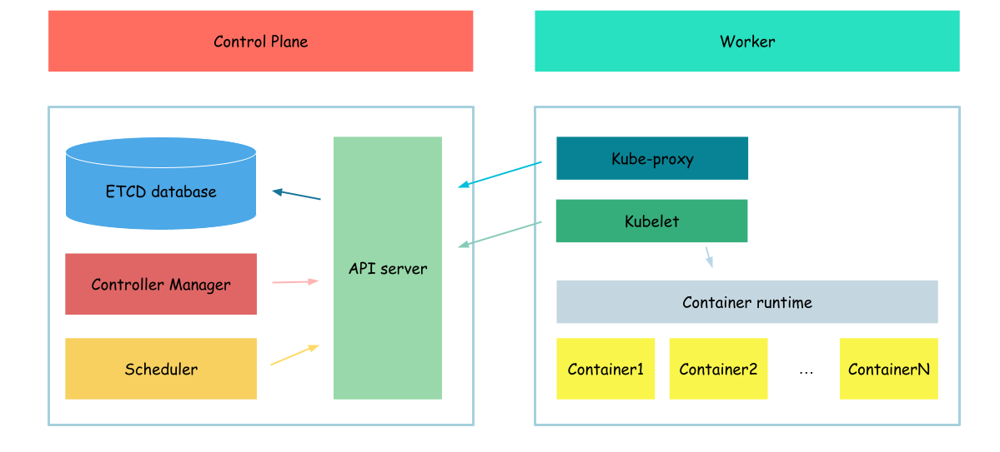

# Kubernetes architecture

Kubernetes architecture consists of a control plane and worker nodes, which together enable efficient container orchestration and management.

## Control plane

From [documentation](https://kubernetes.io/docs/concepts/overview/components/#control-plane-components)
> The control plane's components make global decisions about the cluster (for example, scheduling), as well as detecting and responding to cluster events (for example, starting up a new pod when a deployment's replicas field is unsatisfied).

The control plane comprised of several components, each with specific responsibilities:

1. API Server: The Kubernetes API server acts as the front-end for the control plane, exposing the Kubernetes API. It processes RESTful requests to manage cluster resources and updates the cluster's state accordingly.
2. etcd: A distributed key-value store, etcd stores the configuration data and state of the cluster, providing a reliable and consistent source of truth. It is crucial for maintaining the overall health and stability of the cluster.
3. Controller Manager: This component runs various controllers, such as the Node Controller, Replication Controller, and Endpoints Controller. These controllers monitor the state of the cluster and make necessary changes to achieve and maintain the desired state.
4. Scheduler: The Kubernetes scheduler is responsible for allocating resources and workloads to worker nodes based on multiple factors, such as resource requirements, node affinity/anti-affinity rules, and other constraints. It ensures efficient resource utilization and workload distribution across the cluster.

## Worker nodes

From [documentation](https://kubernetes.io/docs/concepts/overview/components/#node-components)
> Node components run on every node, maintaining running pods and providing the Kubernetes runtime environment.

Each worker node includes the following components:

1. Container Runtime: The software responsible for running and managing containers on the worker nodes. Examples of container runtime include containerd, CRI-O etc. The container runtime is responsible for pulling images, creating containers, and managing container lifecycles.
2. Kubelet: A primary node agent, the Kubelet communicates with the control plane, ensuring that the containers are running as expected. Kubelet monitors the state of the containers and reports back to the control plane, and it is responsible for starting, stopping, and maintaining application containers as directed by the control plane.
3. Kube-proxy: A network proxy that runs on each worker node, maintaining network rules and facilitating communication between services within the cluster and external clients. Kube-proxy is responsible for implementing service abstractions, such as load balancing and forwarding client requests to the appropriate backend pods.

During the tutorial, we will configure each component one by one (in a more or less logical way) and try to understand a bit more deeply the responsibilities of each component.

Next: [Container runtime](./01-container-runtime.md)
