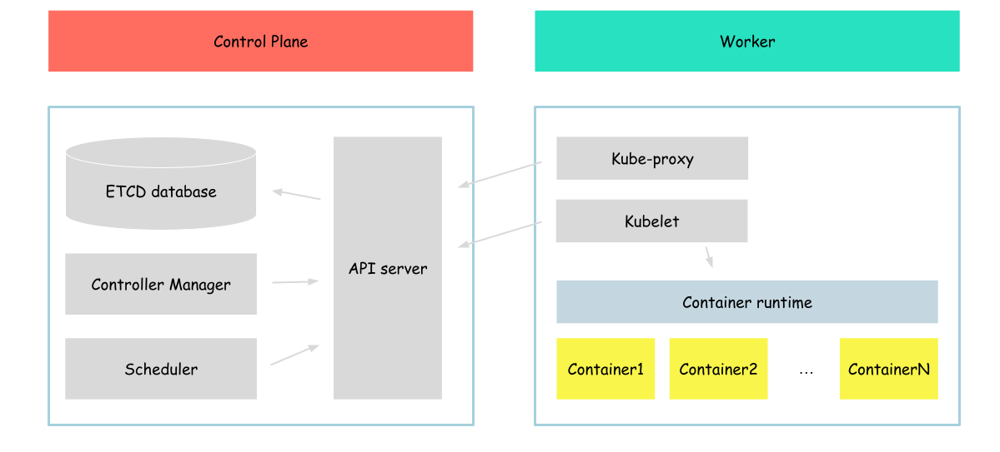

# Container runtime

In this section, we will focus on the container runtime.



## runc

First of all, since Kubernetes is an orchestrator for containers, we would like to figure out how to run containers.
A thing like OCI can help us here.

> The OCI is a project under the Linux Foundation is aims to develop open industry standards for container formats and runtimes. The primary goal of OCI is to ensure container portability and interoperability across different platforms and container runtime implementations. The OCI has two main specifications, Runtime Specification (runtime-spec) and Image Specification (image-spec).

As we can see from the description - OCI is a standard that tells us what is a container image and how to run it.

But it is only a standard, obviously, there is some tool that implements this standard. And it is true, runc is a reference implementation of the OCI runtime specification.

So let's install it and run some container with the usage of runc

First of all we need to download runc binaries

```bash
wget -q --show-progress --https-only --timestamping \
  https://github.com/opencontainers/runc/releases/download/v1.0.0-rc93/runc.amd64
```

After the download process is complete, we need to move runc binaries to proper folder

```bash
{
    sudo mv runc.amd64 runc
    chmod +x runc 
    sudo mv runc /usr/local/bin/
}
```

Now, as we have runc configured, we can run busybox container

```bash
{
mkdir -p ~/busybox-container/rootfs/bin
cd ~/busybox-container/rootfs/bin
wget https://www.busybox.net/downloads/binaries/1.31.0-defconfig-multiarch-musl/busybox-x86_64
chmod +x busybox-x86_64
./busybox-x86_64 --install .
cd ~/busybox-container
runc spec
sed -i 's/"sh"/"echo","Hello from container runned by runc!"/' config.json
}
```

In this step, we downloaded the busybox image, unarchived it, and created the proper files, required by runc to run the container (including container configuration and files that will be accessible from the container). So, let's run our container

```bash
runc run busybox
```

Output:
```
Hello from container runned by runc!
```

Great, we created our first container in this tutorial. Now we will clean up our workspace.
```bash
{
cd ~
rm -r busybox-container
}
```

## containerd

As we can see, runc can run containers, but runc interface is something unknown for kubernetes. 

There is another standard defined which is used by kubelet to communicate with container runtime - CRI
> The CRI is a plugin interface which enables the kubelet to use a wide variety of container runtimes, without having a need to recompile the cluster components.

In this tutorial, we will use [containerd](https://github.com/containerd/containerd) as a tool which is compattible with CRI.

To deploy containerd, first of all, we need to download it.

```bash
wget -q --show-progress --https-only --timestamping \
  https://github.com/containerd/containerd/releases/download/v1.4.4/containerd-1.4.4-linux-amd64.tar.gz
```

After download process complete, we need to unzip and move containerd binaries to proper folder

```bash
{
    mkdir containerd
    tar -xvf containerd-1.4.4-linux-amd64.tar.gz -C containerd
    sudo mv containerd/bin/* /bin/
}
```

In comparison to the runc, containerd is a service that works like a service that can be called by someone to run a container. It means that we need to run it before we can start communicating with it.

We will configure containerd as a service.

To do that, we need to create containerd configuration file
```bash
{
sudo mkdir -p /etc/containerd/

cat << EOF | sudo tee /etc/containerd/config.toml
[plugins]
  [plugins.cri.containerd]
    snapshotter = "overlayfs"
    [plugins.cri.containerd.default_runtime]
      runtime_type = "io.containerd.runtime.v1.linux"
      runtime_engine = "/usr/local/bin/runc"
      runtime_root = ""
EOF
}
```

As we can see, we configured containerd to use runc (we installed before) to run containers.

After configuration file create, we need to create containerd service
```bash
cat <<EOF | sudo tee /etc/systemd/system/containerd.service
[Unit]
Description=containerd container runtime
Documentation=https://containerd.io
After=network.target

[Service]
ExecStartPre=/sbin/modprobe overlay
ExecStart=/bin/containerd
Restart=always
RestartSec=5
Delegate=yes
KillMode=process
OOMScoreAdjust=-999
LimitNOFILE=1048576
LimitNPROC=infinity
LimitCORE=infinity

[Install]
WantedBy=multi-user.target
EOF
```

And now, run it
```bash
{
  sudo systemctl daemon-reload
  sudo systemctl enable containerd
  sudo systemctl start containerd
}
```

To ensure that our service successfully started, run
```bash
sudo systemctl status containerd
```

Output:
```
● containerd.service - containerd container runtime
     Loaded: loaded (/etc/systemd/system/containerd.service; enabled; vendor preset: enabled)
     Active: active (running) since Sat 2023-04-15 21:04:43 UTC; 59s ago
       Docs: https://containerd.io
    Process: 1018 ExecStartPre=/sbin/modprobe overlay (code=exited, status=0/SUCCESS)
   Main PID: 1031 (containerd)
      Tasks: 9 (limit: 2275)
     Memory: 22.0M
     CGroup: /system.slice/containerd.service
             └─1031 /bin/containerd
...
```

Now, we have containerd service running. It means that we can try to create some container.

To do that, we need the tool called [ctr](https://github.com/projectatomic/containerd/blob/master/docs/cli.md), which is distributed as part of containerd (which means that we already installed it during the installation of containerd).

First of all, we will pull busybox image
```bash
sudo ctr images pull docker.io/library/busybox:latest
```

After the pull process is complete - check our image
```bash
ctr images ls
```

Output:
```
REF                              TYPE                                                      DIGEST                                                                  SIZE    PLATFORMS                                                                                                                          LABELS
docker.io/library/busybox:latest application/vnd.docker.distribution.manifest.list.v2+json sha256:b5d6fe0712636ceb7430189de28819e195e8966372edfc2d9409d79402a0dc16 2.5 MiB linux/386,linux/amd64,linux/arm/v5,linux/arm/v6,linux/arm/v7,linux/arm64/v8,linux/mips64le,linux/ppc64le,linux/riscv64,linux/s390x -
```

Now, let's start our container
```bash
ctr run -t --rm --detach docker.io/library/busybox:latest busybox-container sh -c 'echo "Hello from container runned by containerd!"'
```

Output:
```bash
Hello from container runned by containerd!
```

As we can see we successfully started the container, now we can check its status
```bash
ctr containers ls
```

Output:
```
CONTAINER             IMAGE                               RUNTIME
busybox-container     docker.io/library/busybox:latest    io.containerd.runc.v2
``` 

But there is no info about the status, we can see it by reviewing tasks
```bash
ctr task ls
```

Output:
```
TASK                  PID        STATUS
busybox-container     2862580    STOPPED
```

As we can see our container is in the stopped state (because the command was successfully executed and the container stopped).

Now, let's clean up our workspace and go to the next section.
```bash
ctr containers rm busybox-container
```

We can check that list of containers and tasks should be empty
```bash
{
ctr task ls
ctr containers ls
}
``` 

We should receive an empty output

Next: [Kubelet](./02-kubelet.md)
