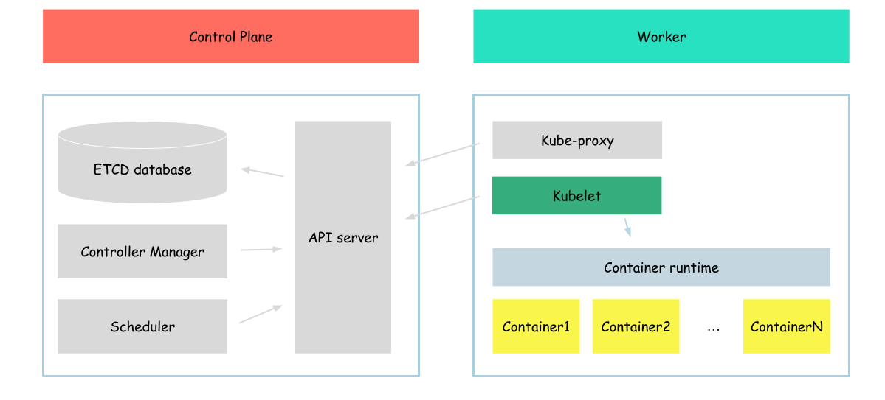

# Kubelet

In this part of tutorial we will configure (it is better to say that we will partially configure) kubelet on our server.

But before we will configure kubelet, lets talk a bit about it.

As mentioned in the official kubernetes documentation:
> An agent that runs on each node in the cluster. It makes sure that containers are running in a Pod.
> The kubelet takes a set of PodSpecs that are provided through various mechanisms and ensures that the containers described in those PodSpecs are running and healthy.



As we can see, in this section we will work with the next layer of kubernetes components (if I can say so).
Previously we worked with containers, but on this step we will work with other afteraction kubernetes has - pod.

As you remember at the end, kubernetes usually start pods. So now we will try to create it. But it a bit not usual way, instead of using kubernetes api (which we didn't configured yet), we will create pods with the usage of kubelet only.
To do that we will use the [static pods](https://kubernetes.io/docs/tasks/configure-pod-container/static-pod/) functionality.

So, lets begin.

First of all we need to download kubelet.
```bash
wget -q --show-progress --https-only --timestamping \
  https://storage.googleapis.com/kubernetes-release/release/v1.21.0/bin/linux/amd64/kubelet
```

After download process complete, muve kubelet binaries to the proper folder
```bash
{
  chmod +x kubelet 
  sudo mv kubelet /usr/local/bin/
}
```

As kubelet is a service which is used to manage pods running on the node, we need to configure that service
```bash
cat <<EOF | sudo tee /etc/systemd/system/kubelet.service
[Unit]
Description=kubelet: The Kubernetes Node Agent
Documentation=https://kubernetes.io/docs/home/
Wants=network-online.target
After=network-online.target

[Service]
ExecStart=/usr/local/bin/kubelet \\
  --container-runtime=remote \\
  --container-runtime-endpoint=unix:///var/run/containerd/containerd.sock \\
  --image-pull-progress-deadline=2m \\
  --file-check-frequency=10s \\
  --pod-manifest-path='/etc/kubernetes/manifests/' \\
  --v=10
Restart=always
StartLimitInterval=0
RestartSec=10

[Install]
WantedBy=multi-user.target
EOF
```

The main configuration parameters here:
- --container-runtime-endpoint - linux soket on which containerd listed for the requests
- --file-check-frequency - how often kubelet will check for the updates of static pods
- --pod-manifest-path - directory where we will place our pod manifest files

After our service configured, we can start it
```bash
{
  sudo systemctl daemon-reload
  sudo systemctl enable kubelet
  sudo systemctl start kubelet
}
```

To ensure that our service successfully started, run
```bash
sudo systemctl status kubelet
```

The output should be similar to
```
● kubelet.service - kubelet: The Kubernetes Node Agent
     Loaded: loaded (/etc/systemd/system/kubelet.service; enabled; vendor preset: enabled)
     Active: active (running) since Sat 2023-04-15 22:01:06 UTC; 2s ago
       Docs: https://kubernetes.io/docs/home/
   Main PID: 16701 (kubelet)
      Tasks: 7 (limit: 2275)
     Memory: 14.8M
     CGroup: /system.slice/kubelet.service
             └─16701 /usr/local/bin/kubelet --container-runtime=remote --container-runtime-endpoint=unix:///var/run/containerd/containerd.sock --image-pull-progress-deadline=2m --v=2
...
```

After kubelet service up and running, we can start creating our pods.

Before we will create static pod manifests, we need to create folders where we will place our pods (same as we configured in kubelet)

```bash
{
mkdir /etc/kubernetes
mkdir /etc/kubernetes/manifests
}
```

After directory created, we can create static pod with busybox container inside 
```bash
cat <<EOF> /etc/kubernetes/manifests/static-pod.yml
apiVersion: v1
kind: Pod
metadata:
  name: static-pod
  labels:
    app: static-pod
spec:
  hostNetwork: true
  containers:
  - name: busybox
    image: busybox
    command: ["sh", "-c", "while true; do echo 'Hello from static pod'; sleep 5; done"]
EOF
```

Now lets use the ctr tool we already know to list the containers created
```bash
ctr containers ls
```

Output:
```bash
CONTAINER    IMAGE    RUNTIME
```

Looks like containerd didn't created any containrs yet? 
Of course it may be true, but based on the output of ctr command we can't confirm that.

Containerd has namespace feature. Namespace is a mechanism used to provide isolation and separation between different sets of resources.

We can check containerd namespaces by running
```bash
ctr namespace ls
```

Output:
```
NAME    LABELS
default
k8s.io
```

Containers created by kubelet located in the k8s.io namespace, to see them run
```bash
ctr --namespace k8s.io containers ls
```

Output:
```
CONTAINER                                                           IMAGE                                                                      RUNTIME
33d2725dd9f343de6dd0d4b77161a532ae17d410b266efb31862605453eb54e0    k8s.gcr.io/pause:3.2                                                       io.containerd.runtime.v1.linux
e75eb4ac89f32ccfb6dc6e894cb6b4429b6dc70eba832bc6dea4dc69b03dec6e    sha256:af2c3e96bcf1a80da1d9b57ec0adc29f73f773a4a115344b7e06aec982157a33    io.containerd.runtime.v1.linux
```

And to get container status we can call
```bash
ctr --namespace k8s.io task ls
```

Output:
```
TASK                                                                PID     STATUS
e75eb4ac89f32ccfb6dc6e894cb6b4429b6dc70eba832bc6dea4dc69b03dec6e    1524    RUNNING
33d2725dd9f343de6dd0d4b77161a532ae17d410b266efb31862605453eb54e0    1472    RUNNING
```

But it is not what we expected, we expected to see container named busybox. Of course there is no majic, all anformation about pod to which this container belongs to, kubernetes containername, etc are located in the metadata on the container, and can be easilly extracted with the usage of other crt command (like this - ctr --namespace k8s.io containers info a597ed1f8dee6a43d398173754fd028c7ac481ee27e09ad4642187ed408814b4). but we want to see it in a bit more readable format, this is why, we will use different tool - [crictl](http://google.com/crictl).

In Comparison to the ctr (which can work with containerd only), crictl is a tool which interracts with any CRI compliant runtime, containerd is only runtime we use in this tutorial. Also, cri ctl provide information in more "kubernetes" way (i mean it can show pods and containers with names like in kubernetes).

So, lets download crictl binaries
```bash
wget -q --show-progress --https-only --timestamping \
  https://github.com/kubernetes-sigs/cri-tools/releases/download/v1.21.0/crictl-v1.21.0-linux-amd64.tar.gz
```

After download process complete, move crictl binaries to the proper folder
```bash
{
  tar -xvf crictl-v1.21.0-linux-amd64.tar.gz
  chmod +x crictl 
  sudo mv crictl /usr/local/bin/
}
```

And configure it a bit
```bash
cat <<EOF> /etc/crictl.yaml
runtime-endpoint: unix:///run/containerd/containerd.sock
image-endpoint: unix:///run/containerd/containerd.sock
timeout: 10
debug: false
EOF
```

As already mentioned, crictl can be configured to use any CRI complient runtime, in our case we configured containerd (by providing containerd socket path).

And we can finaly get the list of pods running on our server
```bash
crictl pods
```

Outout:
```
POD ID              CREATED             STATE               NAME                        NAMESPACE           ATTEMPT             RUNTIME
16595e954ab3e       8 minutes ago       Ready               static-pod-example-server   default             0                   (default)
```

As we can see our pod is up and running.

Also, we can check the containers running inside our pod
```bash
crictl ps
```

Output:
```
CONTAINER           IMAGE               CREATED             STATE               NAME                ATTEMPT             POD ID
912487fb63f9e       7cfbbec8963d8       10 minutes ago      Running             busybox             0                   16595e954ab3e
```

Looks like our container is in running state.
Lets check its logs.
```bash
crictl logs $(crictl ps -q)
```

Output:
```
Hello from static pod
Hello from static pod
Hello from static pod
...
```

Great, now we can run pods on our server.

Now, lets clean up our worspace and continue with the next section
```bash
rm /etc/kubernetes/manifests/static-pod.yml
```

It takes some time to remove the pods, we can ensure that pod are deleted by running 
```bash
{
crictl pods
crictl ps
}
```

The output shuld be empty.

Next: [Pod networking](./03-pod-networking.md)