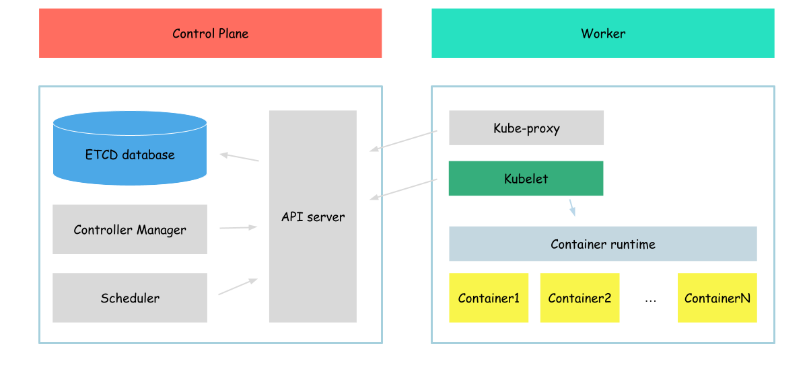

# ETCD

At this point we already know that we can run pods even withour API server. But current aproach is not very confortable to use, to create pod we need to place some manifest in some place. It is not very comfortable to manage. Now we will start our jorney of configuring "real" (more real than current, because current doesn't look like kubernetes at all) kubernetes. And of course we need to start with the storage.



For kubernetes (at least for original one if I can say so) we need to configura database called [etcd](https://etcd.io/).

>etcd is a strongly consistent, distributed key-value store that provides a reliable way to store data that needs to be accessed by a distributed system or cluster of machines. It gracefully handles leader elections during network partitions and can tolerate machine failure, even in the leader node.

Our etcd will be configured as single node database with authentication (by useage of client cert file).

So, lets start.

As I already said, communication with our etcd cluster will be secured, it means that we need to generate some keys, to encrypt all the trafic.
To do so, we need to download tools which may help us to generate certificates
```bash
wget -q --show-progress --https-only --timestamping \
  https://github.com/cloudflare/cfssl/releases/download/v1.4.1/cfssl_1.4.1_linux_amd64 \
  https://github.com/cloudflare/cfssl/releases/download/v1.4.1/cfssljson_1.4.1_linux_amd64
```

And install 
```bash
{
mv cfssl_1.4.1_linux_amd64 cfssl
mv cfssljson_1.4.1_linux_amd64 cfssljson
chmod +x cfssl cfssljson
sudo mv cfssl cfssljson /usr/local/bin/
}
```

After the tools installed successfully, we need to generate ca certificate.

A ca (Certificate Authority) certificate, also known as a root certificate or a trusted root certificate, is a digital certificate that is used to verify the authenticity of other certificates.
```bash
{
cat > ca-config.json <<EOF
{
  "signing": {
    "default": {
      "expiry": "8760h"
    },
    "profiles": {
      "kubernetes": {
        "usages": ["signing", "key encipherment", "server auth", "client auth"],
        "expiry": "8760h"
      }
    }
  }
}
EOF

cat > ca-csr.json <<EOF
{
  "CN": "Kubernetes",
  "key": {
    "algo": "rsa",
    "size": 2048
  },
  "names": [
    {
      "C": "US",
      "L": "Portland",
      "O": "Kubernetes",
      "OU": "CA",
      "ST": "Oregon"
    }
  ]
}
EOF

cfssl gencert -initca ca-csr.json | cfssljson -bare ca
}
```

Generated files:
```
ca-key.pem
ca.csr
ca.pem
```

Now, we can create certificate files signed by our ca file. 

> to simplify our kubernetes deployment, we will use this certificate for other kubernetes components as well, that is why we will add some extra configs (like KUBERNETES_HOST_NAME to it)
```bash
{
HOST_NAME=$(hostname -a)
KUBERNETES_HOSTNAMES=kubernetes,kubernetes.default,kubernetes.default.svc,kubernetes.default.svc.cluster,kubernetes.svc.cluster.local

cat > kubernetes-csr.json <<EOF
{
  "CN": "kubernetes",
  "key": {
    "algo": "rsa",
    "size": 2048
  },
  "names": [
    {
      "C": "US",
      "L": "Portland",
      "O": "Kubernetes",
      "OU": "Kubernetes The Hard Way",
      "ST": "Oregon"
    }
  ]
}
EOF

cfssl gencert \
  -ca=ca.pem \
  -ca-key=ca-key.pem \
  -config=ca-config.json \
  -hostname=worker,127.0.0.1,${KUBERNETES_HOSTNAMES},10.32.0.1 \
  -profile=kubernetes \
  kubernetes-csr.json | cfssljson -bare kubernetes
}
```

Generated files:
```
kubernetes.csr
kubernetes-key.pem
kubernetes.pem
```

Now, we have all required certificates, so, lets download etcd
```bash
wget -q --show-progress --https-only --timestamping \
  "https://github.com/etcd-io/etcd/releases/download/v3.4.15/etcd-v3.4.15-linux-amd64.tar.gz"
```

After donload complete, we can move etcd binaries to proper folders
```bash
{
  tar -xvf etcd-v3.4.15-linux-amd64.tar.gz
  sudo mv etcd-v3.4.15-linux-amd64/etcd* /usr/local/bin/
}
```

Now, we can start wioth the configurations of the etcd service. First of all, we need to discribute previuosly generated certificates to the proper folder
```bash
{
  sudo mkdir -p /etc/etcd /var/lib/etcd
  sudo chmod 700 /var/lib/etcd
  sudo cp ca.pem \
    kubernetes.pem kubernetes-key.pem \
    /etc/etcd/
}
```

Create etcd service configuration file
```bash
cat <<EOF | sudo tee /etc/systemd/system/etcd.service
[Unit]
Description=etcd
Documentation=https://github.com/coreos

[Service]
Type=notify
ExecStart=/usr/local/bin/etcd \\
  --client-cert-auth \\
  --name etcd \\
  --cert-file=/etc/etcd/kubernetes.pem \\
  --key-file=/etc/etcd/kubernetes-key.pem \\
  --trusted-ca-file=/etc/etcd/ca.pem \\
  --listen-client-urls https://127.0.0.1:2379 \\
  --advertise-client-urls https://127.0.0.1:2379 \\
  --data-dir=/var/lib/etcd
Restart=on-failure
RestartSec=5

[Install]
WantedBy=multi-user.target
EOF
```

Configuration options specified:
- client-cert-auth - this configuration option tels etcd to enable the authentication of clients using SSL/TLS client certificates. When client-cert-auth is enabled, etcd requires that clients authenticate themselves by presenting a valid SSL/TLS client certificate during the TLS handshake. This certificate must be signed by a trusted certificate authority (CA) and include the client's identity information
- name - used to specify the unique name of an etcd member
- cert-file - path to the SSL/TLS certificate file that the etcd server presents to clients during the TLS handshake
- key-file - path to the SSL/TLS private key file that corresponds to the SSL/TLS certificate presented by the etcd server during the TLS handshake
- trusted-ca-file - path to the ca file which will be used by etcd to validate client certificate
- listen-client-urls - specifies the network addresses on which the etcd server listens for client requests
- advertise-client-urls - specifies the network addresses that the etcd server advertises to clients for connecting to the server
- data-dir - directory where etcd stores its data, including the key-value pairs in the etcd key-value store, snapshots, and transaction logs

And finally we need to run our etcd service
```bash
{
sudo systemctl daemon-reload
sudo systemctl enable etcd
sudo systemctl start etcd
}
```

To ensure that our service successfully started, run
```bash
systemctl status etcd
```

The output should be similar to
```
● etcd.service - etcd
     Loaded: loaded (/etc/systemd/system/etcd.service; enabled; vendor preset: enabled)
     Active: active (running) since Thu 2023-04-20 10:55:03 UTC; 18s ago
       Docs: https://github.com/coreos
   Main PID: 12374 (etcd)
      Tasks: 10 (limit: 2275)
     Memory: 4.2M
     CGroup: /system.slice/etcd.service
             └─12374 /usr/local/bin/etcd --name etcd --cert-file=/etc/etcd/kubernetes.pem --key-file=/etc/
...
```

Now, when etcd is up and running, we can check wheather we can communicate with it
```
sudo ETCDCTL_API=3 etcdctl member list \
  --endpoints=https://127.0.0.1:2379 \
  --cacert=/etc/etcd/ca.pem \
  --cert=/etc/etcd/kubernetes.pem \
  --key=/etc/etcd/kubernetes-key.pem
```

Output:
```bash
8e9e05c52164694d, started, etcd, http://localhost:2380, https://127.0.0.1:2379, false
```

As you can see, to communicate with our etcd service, we specified cert and key file, this the the same file we used to configure etcd, it is only to simplity our deployment, in real life, we can use different certificate which is signed by the same ca file.

Next: [Api Server](./05-apiserver.md)