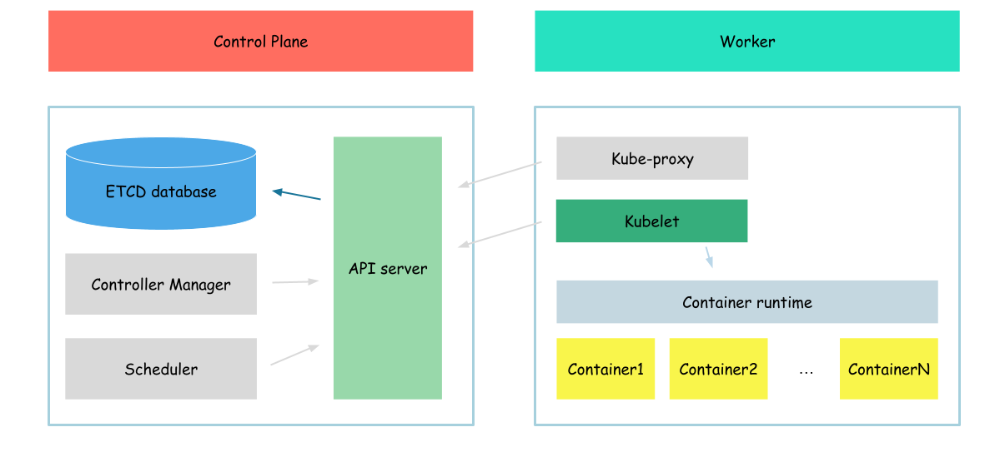

# Api Server

In this section we will configure kubernetes API server.
> The Kubernetes API server validates and configures data for the api objects which include pods, services, replicationcontrollers, and others. The API Server services REST operations and provides the frontend to the cluster's shared state through which all other components interact.

As you can see from the description adpi server is central (not main) component of kubernetes cluster.



## certificates

Before we begin with configuration of API server, we need to create certificates for kubernetes that will be used to sign service account tokens.

```bash
{
cat > service-account-csr.json <<EOF
{
  "CN": "service-accounts",
  "key": {
    "algo": "rsa",
    "size": 2048
  },
  "names": [
    {
      "C": "US",
      "L": "Portland",
      "O": "Kubernetes",
      "OU": "Kubernetes The Hard Way",
      "ST": "Oregon"
    }
  ]
}
EOF

cfssl gencert \
  -ca=ca.pem \
  -ca-key=ca-key.pem \
  -config=ca-config.json \
  -profile=kubernetes \
  service-account-csr.json | cfssljson -bare service-account
}
```

Now, we need to distbibute certificates to the api server configuration folder
```bash
{
mkdir /var/lib/kubernetes/
sudo cp \
  ca.pem \
  kubernetes.pem kubernetes-key.pem \
  service-account-key.pem service-account.pem \
  /var/lib/kubernetes/
}
```

As you can see, in addition to the generated service-account certificate file, we also distributed certificate generated in [previous](./04-etcd.md) section. We will use that certificate for communication between 
- api server and etcd
- as certificate when comunication with api server

Also, we will use ca file to validate certificate files of the other components wo comminucate with api server.

## data encryption

Also, we will configure api server to encrypt data sensitive before saving it to the etcd database. To do that we need to create encryption config file.
```bash
{
ENCRYPTION_KEY=$(head -c 32 /dev/urandom | base64)

cat > /var/lib/kubernetes/encryption-config.yaml <<EOF
kind: EncryptionConfig
apiVersion: v1
resources:
  - resources:
      - secrets
    providers:
      - aescbc:
          keys:
            - name: key1
              secret: ${ENCRYPTION_KEY}
      - identity: {}
EOF
}
```
This config days kubernetes to encrypt secrets when storing it in etcd with the usage of aescbc encryption provider.

## service configuration

Now, when all required configuration/certificate files created and distributed to the proper folders, we can downlad binaries and enable api server as service.

First of all we need to download and install api server binaries

```bash
{
wget -q --show-progress --https-only --timestamping \
  "https://storage.googleapis.com/kubernetes-release/release/v1.21.0/bin/linux/amd64/kube-apiserver"
  chmod +x kube-apiserver
  sudo mv kube-apiserver /usr/local/bin/
}
```

And create service configuration file

```bash
cat <<EOF | sudo tee /etc/systemd/system/kube-apiserver.service
[Unit]
Description=Kubernetes API Server
Documentation=https://github.com/kubernetes/kubernetes

[Service]
ExecStart=/usr/local/bin/kube-apiserver \\
  --allow-privileged='true' \\
  --audit-log-maxage='30' \\
  --audit-log-maxbackup='3' \\
  --audit-log-maxsize='100' \\
  --audit-log-path='/var/log/audit.log' \\
  --authorization-mode='Node,RBAC' \\
  --bind-address='0.0.0.0' \\
  --client-ca-file='/var/lib/kubernetes/ca.pem' \\
  --enable-admission-plugins='NamespaceLifecycle,NodeRestriction,LimitRanger,ServiceAccount,DefaultStorageClass,ResourceQuota' \\
  --etcd-cafile='/var/lib/kubernetes/ca.pem' \\
  --etcd-certfile='/var/lib/kubernetes/kubernetes.pem' \\
  --etcd-keyfile='/var/lib/kubernetes/kubernetes-key.pem' \\
  --etcd-servers='https://127.0.0.1:2379' \\
  --event-ttl='1h' \\
  --encryption-provider-config='/var/lib/kubernetes/encryption-config.yaml' \\
  --kubelet-certificate-authority='/var/lib/kubernetes/ca.pem' \\
  --kubelet-client-certificate='/var/lib/kubernetes/kubernetes.pem' \\
  --kubelet-client-key='/var/lib/kubernetes/kubernetes-key.pem' \\
  --runtime-config='api/all=true' \\
  --service-account-key-file='/var/lib/kubernetes/service-account.pem' \\
  --service-cluster-ip-range='10.32.0.0/24' \\
  --service-node-port-range='30000-32767' \\
  --tls-cert-file='/var/lib/kubernetes/kubernetes.pem' \\
  --tls-private-key-file='/var/lib/kubernetes/kubernetes-key.pem' \\
  --service-account-signing-key-file='/var/lib/kubernetes/service-account-key.pem' \\
  --service-account-issuer='https://kubernetes.default.svc.cluster.local' \\
  --api-audiences='https://kubernetes.default.svc.cluster.local' \\
  --v='2'
Restart=on-failure
RestartSec=5

[Install]
WantedBy=multi-user.target
EOF
```

Configuration options I want to highlight:
- client-ca-file - certificate file which will be used to validate client certificates and authenticate users

Now, when api-server service is configured, we can start it
```bash
{
sudo systemctl daemon-reload
sudo systemctl enable kube-apiserver
sudo systemctl start kube-apiserver
}
```

And check service status

```bash
sudo systemctl status kube-apiserver
```

Output:
```
● kube-apiserver.service - Kubernetes API Server
     Loaded: loaded (/etc/systemd/system/kube-apiserver.service; enabled; vendor preset: enabled)
     Active: active (running) since Thu 2023-04-20 11:04:29 UTC; 22s ago
       Docs: https://github.com/kubernetes/kubernetes
   Main PID: 12566 (kube-apiserver)
      Tasks: 8 (limit: 2275)
     Memory: 291.6M
     CGroup: /system.slice/kube-apiserver.service
             └─12566 /usr/local/bin/kube-apiserver --advertise-address=91.107.220.4 --allow-privileged=true --apiserver-count=3 --audit-log-maxage=30 --audit-log-maxbackup=3 --audit-log-m>
...
```

## communication with api server

Now, when our server is up and running, we want to communicate with it. To do that we will use cubectl tool. So lets download and install it

```bash
wget -q --show-progress --https-only --timestamping \
  https://storage.googleapis.com/kubernetes-release/release/v1.21.0/bin/linux/amd64/kubectl \
  && chmod +x kubectl \
  && sudo mv kubectl /usr/local/bin/
```

As our server is configured to use RBAC authorization, we need to authirize to our server in somehow. To do that, we will generate certificate file which will be signed by ca cert, and have "admin" CN property.

```bash
{
cat > admin-csr.json <<EOF
{
  "CN": "admin",
  "key": {
    "algo": "rsa",
    "size": 2048
  },
  "names": [
    {
      "C": "US",
      "L": "Portland",
      "O": "system:masters",
      "OU": "Kubernetes The Hard Way",
      "ST": "Oregon"
    }
  ]
}
EOF

cfssl gencert \
  -ca=ca.pem \
  -ca-key=ca-key.pem \
  -config=ca-config.json \
  -profile=kubernetes \
  admin-csr.json | cfssljson -bare admin
}
```

Now, when our certificate file generated, we can use it in kubectl. To do that we will update default kubectl config file (actually we will create it) to use the proper certs and connection options.
```bash
{
kubectl config set-cluster kubernetes-the-hard-way \
  --certificate-authority=ca.pem \
  --embed-certs=true \
  --server=https://127.0.0.1:6443

kubectl config set-credentials admin \
  --client-certificate=admin.pem \
  --client-key=admin-key.pem \
  --embed-certs=true

kubectl config set-context default \
  --cluster=kubernetes-the-hard-way \
  --user=admin

kubectl config use-context default
}
```

Now, we should be able to receive our cluster and kubeclt info

```bash
kubectl version
```

Output:
```
Client Version: version.Info{Major:"1", Minor:"21", GitVersion:"v1.21.0", GitCommit:"cb303e613a121a29364f75cc67d3d580833a7479", GitTreeState:"clean", BuildDate:"2021-04-08T16:31:21Z", GoVersion:"go1.16.1", Compiler:"gc", Platform:"linux/amd64"}
Server Version: version.Info{Major:"1", Minor:"21", GitVersion:"v1.21.0", GitCommit:"cb303e613a121a29364f75cc67d3d580833a7479", GitTreeState:"clean", BuildDate:"2021-04-08T16:25:06Z", GoVersion:"go1.16.1", Compiler:"gc", Platform:"linux/amd64"}
```

As I already mentioned, api-server is central kubernetes component, which stores information about all kubernetes objects, it means that we can create pod, even when other components (kubelet, scheduler, controller manager) not configured

```bash
{
HOST_NAME=$(hostname -a)

cat <<EOF> pod.yaml
apiVersion: v1
kind: Pod
metadata:
  name: hello-world
spec:
  serviceAccountName: hello-world
  containers:
    - name: hello-world-container
      image: busybox
      command: ['sh', '-c', 'while true; do echo "Hello, World!"; sleep 1; done']
  nodeName: ${HOST_NAME}
EOF

cat <<EOF> sa.yaml
apiVersion: v1
kind: ServiceAccount
metadata:
  name: hello-world
automountServiceAccountToken: false
EOF

kubectl apply -f sa.yaml
kubectl apply -f pod.yaml
}
```

Note: as you can see, in addition to the pod, we create service account associated with our pod. This step is needed as we have now default service account created in default namespace (service account controller is responsible to create it, but we didn't configure controller manager yet).

To check pod status run
```bash
kubectl get pod
```

Output:
```
NAME          READY   STATUS    RESTARTS   AGE
hello-world   0/1     Pending   0          29s
```

As expected we received pod in pending state, because we have now kubelet configured to run pods created in API server.

To ensure we can check it
```bash
kubectl get nodes
```

Output:
```
NAME             STATUS     ROLES    AGE   VERSION
```

Next: [Apiserver - Kubelet integration](./06-apiserver-kubelet.md)
