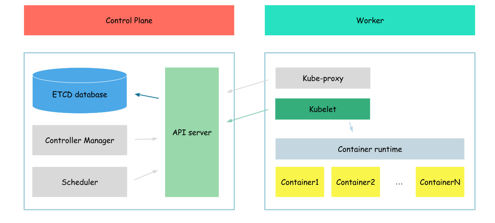

# Apiserver - Kubelet integration

In this section, we will configure kubelet, to run not only static pods but also pods, created in API server.



## certificates

Again we will start this part with the creation of the certificates which will be used by kubelet to communicate with api server, and also when api server will communicate with kubelet.

```bash
{
HOST_NAME=$(hostname -a)
cat > kubelet-csr.json <<EOF
{
  "CN": "system:node:${HOST_NAME}",
  "key": {
    "algo": "rsa",
    "size": 2048
  },
  "names": [
    {
      "C": "US",
      "L": "Portland",
      "O": "system:nodes",
      "OU": "Kubernetes The Hard Way",
      "ST": "Oregon"
    }
  ]
}
EOF

cfssl gencert \
  -ca=ca.pem \
  -ca-key=ca-key.pem \
  -config=ca-config.json \
  -hostname=127.0.0.1,${HOST_NAME} \
  -profile=kubernetes \
  kubelet-csr.json | cfssljson -bare kubelet
}
```

Create certificates:
```
kubelet.csr
kubelet-key.pem
kubelet.pem
```

The most interesting configuration options:
- cn(common name) - value api server will use as a client name during authorization
- o(organozation) - user group api server will use during authorization

We specified "system:nodes" in the organization. It says api server that the client who uses which certificate belongs to the system:nodes group.

Now we need to distribute certificates generated.

```bash
{
  sudo cp kubelet-key.pem kubelet.pem /var/lib/kubelet/
  sudo cp ca.pem /var/lib/kubernetes/
}
```

## service configuration

After certificates configured and distributed, we need to prepare configuration files for kubelet.

```bash
{
HOST_NAME=$(hostname -a)
kubectl config set-cluster kubernetes-the-hard-way \
    --certificate-authority=ca.pem \
    --embed-certs=true \
    --server=https://127.0.0.1:6443 \
    --kubeconfig=kubelet.kubeconfig

kubectl config set-credentials system:node:${HOST_NAME} \
    --client-certificate=kubelet.pem \
    --client-key=kubelet-key.pem \
    --embed-certs=true \
    --kubeconfig=kubelet.kubeconfig

kubectl config set-context default \
    --cluster=kubernetes-the-hard-way \
    --user=system:node:${HOST_NAME} \
    --kubeconfig=kubelet.kubeconfig

kubectl config use-context default --kubeconfig=kubelet.kubeconfig
}
```

We created kubernetes configuration file, which says kubelet where api server is configured and chich certificates to use communicating with it

And now, move all our configuration settings to the proper folders

```bash
sudo cp kubelet.kubeconfig /var/lib/kubelet/kubeconfig
```

Alsom we need to create KubeletConfiguration
```bash
cat <<EOF | sudo tee /var/lib/kubelet/kubelet-config.yaml
kind: KubeletConfiguration
apiVersion: kubelet.config.k8s.io/v1beta1
authentication:
  anonymous:
    enabled: false
  webhook:
    enabled: true
  x509:
    clientCAFile: "/var/lib/kubernetes/ca.pem"
authorization:
  mode: Webhook
clusterDomain: "cluster.local"
clusterDNS:
  - "10.32.0.10"
podCIDR: "10.240.1.0/24"
resolvConf: "/run/systemd/resolve/resolv.conf"
runtimeRequestTimeout: "15m"
tlsCertFile: "/var/lib/kubelet/kubelet.pem"
tlsPrivateKeyFile: "/var/lib/kubelet/kubelet-key.pem"
EOF
```

Configuration options I want to highlight:
- podCIDR - the pod network cidr, the same as we configured previously
- tls configuration - certificate files which will be used by kubelet when api server connects to it
- authentication.webgook.enable - means that to authorize requests kubelet will ask api server
- cluster dns - the IP in which cluster DNS server will be hosted (more on this later)

And the last step - we need to update service configuration file
```bash
cat <<EOF | sudo tee /etc/systemd/system/kubelet.service
[Unit]
Description=Kubernetes Kubelet
Documentation=https://github.com/kubernetes/kubernetes
After=containerd.service
Requires=containerd.service

[Service]
ExecStart=/usr/local/bin/kubelet \\
  --config=/var/lib/kubelet/kubelet-config.yaml \\
  --container-runtime=remote \\
  --container-runtime-endpoint=unix:///var/run/containerd/containerd.sock \\
  --image-pull-progress-deadline=2m \\
  --kubeconfig=/var/lib/kubelet/kubeconfig \\
  --network-plugin=cni \\
  --register-node=true \\
  --v=2
Restart=on-failure
RestartSec=5

[Install]
WantedBy=multi-user.target
EOF
```

And reload it

```bash
{
  sudo systemctl daemon-reload
  sudo systemctl enable kubelet
  sudo systemctl restart kubelet
}
```

## verification

And check service status
```bash
sudo systemctl status kubelet
```

Output:
```
● kubelet.service - Kubernetes Kubelet
     Loaded: loaded (/etc/systemd/system/kubelet.service; enabled; vendor preset: enabled)
     Active: active (running) since Thu 2023-05-04 14:37:07 UTC; 11s ago
       Docs: https://github.com/kubernetes/kubernetes
   Main PID: 95898 (kubelet)
      Tasks: 12 (limit: 2275)
     Memory: 53.8M
     CGroup: /system.slice/kubelet.service
             └─95898 /usr/local/bin/kubelet --config=/var/lib/kubelet/kubelet-config.yaml --container-runtime=remote --container-runtime-endpoint=unix:///var/run/containerd/containerd.soc>
...
```

After our kubelet is in running state, we can check if it is registered in API server
```bash
kubectl get nodes
```

Output:
```
NAME             STATUS   ROLES    AGE     VERSION
example-server   Ready    <none>   1m2s    v1.21.0
```

After our kubelet registered in API server we can check wheather our pod is in running state
```bash
kubectl get pod
```

Output:
```
NAME          READY   STATUS    RESTARTS   AGE
hello-world   1/1     Running   0          8m1s
```

As we can see out pod is in running state. In addition to this check we can also check if our pod is really in running state by using crictl
Pods
```bash
crictl pods
```

Output:
```
POD ID              CREATED             STATE               NAME                NAMESPACE           ATTEMPT             RUNTIME
1719d0202a5ef       8 minutes ago       Ready               hello-world         default             0                   (default)
```

Also we can see logs from our pod
```bash
crictl logs $(crictl ps -q)
```

Output:
```
Hello, World!
Hello, World!
Hello, World!
Hello, World!
...
```

But now, lets view logs using kubectl instead of crictl. In our case it is maybe not very important, but in case of cluster with more than 1 node it is important, as crictl allows to read info only about pods on node, when kubectl (by communicating with api server) allows to read info from all nodes.

```bash
kubectl logs hello-world
```

Output:
```
Error from server (Forbidden): Forbidden (user=kubernetes, verb=get, resource=nodes, subresource=proxy) ( pods/log hello-world)
```

As we can see api server has no permissions to read logs from the node. This message apears, because during authorization, kubelet ask api server if the user with the name kubernetes has proper permission, but now it is not true. So let's fix this
```bash
{
cat <<EOF> node-auth.yml
apiVersion: rbac.authorization.k8s.io/v1
kind: ClusterRole
metadata:
  name: node-proxy-access
rules:
- apiGroups: [""]
  resources: ["nodes/proxy"]
  verbs: ["get"]
---
apiVersion: rbac.authorization.k8s.io/v1
kind: ClusterRoleBinding
metadata:
  name: node-proxy-access-binding
roleRef:
  apiGroup: rbac.authorization.k8s.io
  kind: ClusterRole
  name: node-proxy-access
subjects:
- apiGroup: rbac.authorization.k8s.io
  kind: User
  name: kubernetes
EOF

kubectl apply -f node-auth.yml
}
```

After our cluster role and role binding creted we can retry
```bash
kubectl logs hello-world
```

Output:
```
Hello, World!
Hello, World!
Hello, World!
Hello, World!
...
```

As you can see, we can create pods and kubelet will run that pods. 

Now, we need to clean-up out workspace.
```bash
kubectl delete -f pod.yaml
```

Check if pod deleted
```bash
kubectl get pod
```

Outpput:
```
No resources found in default namespace.
```

Next: [Scheduler](./07-controller-manager.md)
Next: [Controller manager](./07-controller-manager.md)