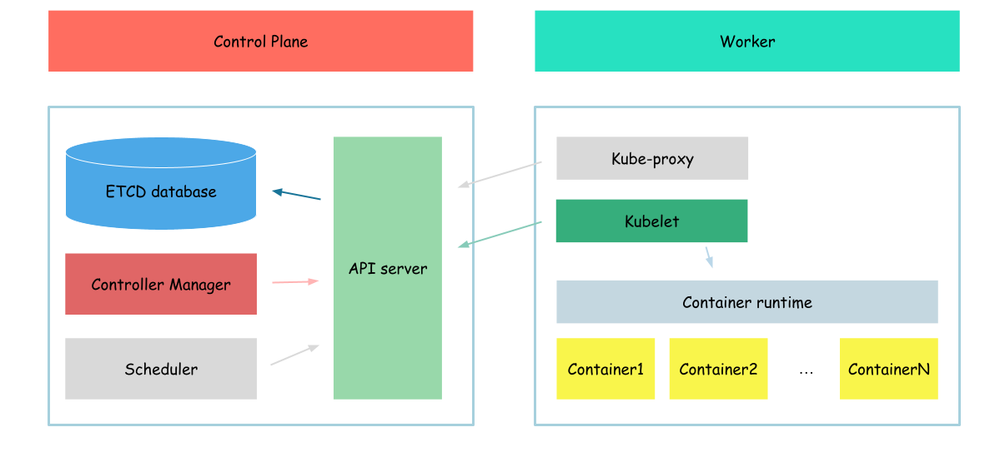

# Controller manager



для того щоб відчути весь смак - давайте почнемо із того що вернемось трохи не до конфігураційних всяких штук а до абстракцій кубернетесу

і власне наша наступна абстракція - деплоймент

тож давайте її створимо

```bash
cat <<EOF> deployment.yaml
apiVersion: apps/v1
kind: Deployment
metadata:
  name: deployment
spec:
  replicas: 1
  selector:
    matchLabels:
      app: hello-world-deployment
  template:
    metadata:
      labels:
        app: hello-world-deployment
    spec:
        serviceAccountName: hello-world
        containers:
            - name: hello-world-container
              image: busybox
              command: ['sh', '-c', 'while true; do echo "Hello, World from deployment!"; sleep 1; done']
EOF

kubectl apply -f deployment.yaml
```

```bash
kubectl get deploy
```

```
NAME               READY   UP-TO-DATE   AVAILABLE   AGE
nginx-deployment   0/1     0            0           24s
```

такс, щось пішло не так
чомусь наші поди не створюються - а мають

за те щоб поди створювались відповідає контроллєр менеджер, а у нас його немає
тож давайте цю проблему вирішувати


```bash
{
cat > kube-controller-manager-csr.json <<EOF
{
  "CN": "system:kube-controller-manager",
  "key": {
    "algo": "rsa",
    "size": 2048
  },
  "names": [
    {
      "C": "US",
      "L": "Portland",
      "O": "system:kube-controller-manager",
      "OU": "Kubernetes The Hard Way",
      "ST": "Oregon"
    }
  ]
}
EOF

cfssl gencert \
  -ca=ca.pem \
  -ca-key=ca-key.pem \
  -config=ca-config.json \
  -profile=kubernetes \
  kube-controller-manager-csr.json | cfssljson -bare kube-controller-manager

}
```

```bash
{
  kubectl config set-cluster kubernetes-the-hard-way \
    --certificate-authority=ca.pem \
    --embed-certs=true \
    --server=https://127.0.0.1:6443 \
    --kubeconfig=kube-controller-manager.kubeconfig

  kubectl config set-credentials system:kube-controller-manager \
    --client-certificate=kube-controller-manager.pem \
    --client-key=kube-controller-manager-key.pem \
    --embed-certs=true \
    --kubeconfig=kube-controller-manager.kubeconfig

  kubectl config set-context default \
    --cluster=kubernetes-the-hard-way \
    --user=system:kube-controller-manager \
    --kubeconfig=kube-controller-manager.kubeconfig

  kubectl config use-context default --kubeconfig=kube-controller-manager.kubeconfig
}
```

```bash
wget -q --show-progress --https-only --timestamping \
  "https://storage.googleapis.com/kubernetes-release/release/v1.21.0/bin/linux/amd64/kube-controller-manager"
```

```bash
{
  chmod +x kube-controller-manager
  sudo mv kube-controller-manager /usr/local/bin/
}
```

```bash
sudo mv kube-controller-manager.kubeconfig /var/lib/kubernetes/
sudo cp ca-key.pem /var/lib/kubernetes/
```

```bash
cat <<EOF | sudo tee /etc/systemd/system/kube-controller-manager.service
[Unit]
Description=Kubernetes Controller Manager
Documentation=https://github.com/kubernetes/kubernetes

[Service]
ExecStart=/usr/local/bin/kube-controller-manager \\
  --bind-address=0.0.0.0 \\
  --cluster-cidr=10.200.0.0/16 \\
  --cluster-name=kubernetes \\
  --cluster-signing-cert-file=/var/lib/kubernetes/ca.pem \\
  --cluster-signing-key-file=/var/lib/kubernetes/ca-key.pem \\
  --kubeconfig=/var/lib/kubernetes/kube-controller-manager.kubeconfig \\
  --leader-elect=true \\
  --root-ca-file=/var/lib/kubernetes/ca.pem \\
  --service-account-private-key-file=/var/lib/kubernetes/service-account-key.pem \\
  --service-cluster-ip-range=10.32.0.0/24 \\
  --use-service-account-credentials=true \\
  --v=2
Restart=on-failure
RestartSec=5

[Install]
WantedBy=multi-user.target
EOF
```

```bash
{
  sudo systemctl daemon-reload
  sudo systemctl enable kube-controller-manager
  sudo systemctl start kube-controller-manager
}
```

```bash
sudo systemctl status kube-controller-manager
```

```
● kube-controller-manager.service - Kubernetes Controller Manager
     Loaded: loaded (/etc/systemd/system/kube-controller-manager.service; enabled; vendor preset: enabled)
     Active: active (running) since Thu 2023-04-20 11:48:41 UTC; 30s ago
       Docs: https://github.com/kubernetes/kubernetes
   Main PID: 14805 (kube-controller)
      Tasks: 6 (limit: 2275)
     Memory: 32.0M
     CGroup: /system.slice/kube-controller-manager.service
             └─14805 /usr/local/bin/kube-controller-manager --bind-address=0.0.0.0 --cluster-cidr=10.200.0.0/16 --cluster-name=kubernetes --cluster-signing-cert-file=/var/lib/kubernetes/c>
...
```

ну контроллер менеджер як бачимо завівся, то може і поди створились?
давайте перевіримо

```bash
kubectl get pod
```

```
NAME                                READY   STATUS    RESTARTS   AGE
hello-world                         1/1     Running   0          27m
nginx-deployment-5d9cbcf759-x4pk8   0/1     Pending   0          79s
```

такс, ну под уже сворився, але він ще у статусі пендінг якось не особо цікаво

відповідь на питання чого по ще досі не запущений дуже проста
```bash
kubectl get pod -o wide
```

```
NAME                                READY   STATUS    RESTARTS   AGE     IP           NODE             NOMINATED NODE   READINESS GATES
hello-world                         1/1     Running   0          31m     10.240.1.9   example-server   <none>           <none>
nginx-deployment-5d9cbcf759-x4pk8   0/1     Pending   0          5m22s   <none>       <none>           <none>           <none>
```

бачимо що йому ніхто ще не проставив ноду, а без ноди кублєт сам не запустить под

Next: [Scheduler](./08-scheduler.md)