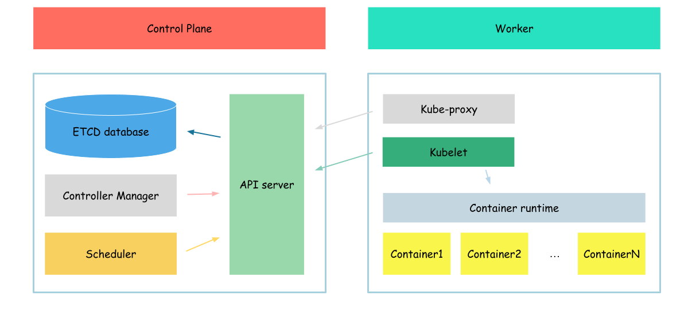

# Scheduler

In this section we will configure scheduler.



> In Kubernetes, a scheduler is a core component responsible for assigning and placing workloads (such as pods) onto available nodes in a cluster. It ensures that the cluster's resources are utilized efficiently and that workloads are scheduled based on their resource requirements and other constraints.
> Kublet, regularly request the list of pods assigned to it. In case if new pod appear, kubelet will run new pod. In case if pod marked as deleted, kubelet will start termination process.

In previous section, we created pod and it was runed on the node, but why?
The reason of that, we specified the node name on which to run the pod by our self
```bash
  nodeName: ${HOST_NAME}
```

So, lets create pod without node specified
```bash
{
cat <<EOF> pod.yaml
apiVersion: v1
kind: Pod
metadata:
  name: hello-world
spec:
  serviceAccountName: hello-world
  containers:
    - name: hello-world-container
      image: busybox
      command: ['sh', '-c', 'while true; do echo "Hello, World!"; sleep 1; done']
EOF

kubectl apply -f pod.yaml
}
```

And check pod status
```bash
kubectl get pod -o wide
```

Output:
```
NAME          READY   STATUS    RESTARTS   AGE   IP       NODE     NOMINATED NODE   READINESS GATES
hello-world   0/1     Pending   0          19s   <none>   <none>   <none>           <none>
```

As we can see node field of our pod is none and pod is in pending state.
So, lets, configure scheduler and check if it will solve the issue.

## certificates

We will start with certificates.

As you remeber we configured our API server cto use client certificate to authenticate user.
So, lets create proper certificate for the scheduler
```bash
{
cat > kube-scheduler-csr.json <<EOF
{
  "CN": "system:kube-scheduler",
  "key": {
    "algo": "rsa",
    "size": 2048
  },
  "names": [
    {
      "C": "US",
      "L": "Portland",
      "O": "system:kube-scheduler",
      "OU": "Kubernetes The Hard Way",
      "ST": "Oregon"
    }
  ]
}
EOF

cfssl gencert \
  -ca=ca.pem \
  -ca-key=ca-key.pem \
  -config=ca-config.json \
  -profile=kubernetes \
  kube-scheduler-csr.json | cfssljson -bare kube-scheduler
}
```

The most interesting configuration options:
- cn(common name) - value, api server will use as a client name during authorization
- o(organozation) - user group api server will use during authorization

We specified "system:kube-scheduler" in the organization. It says api server that the client who uses which certificate belongs to the system:kube-scheduler group. Api server know, that this group is allowed to make proper modifications to pod specification to assign pod to node.

## serviece configuration

After the certificate files created we can create configuration files for the scheduler.

```bash
{
  kubectl config set-cluster kubernetes-the-hard-way \
    --certificate-authority=ca.pem \
    --embed-certs=true \
    --server=https://127.0.0.1:6443 \
    --kubeconfig=kube-scheduler.kubeconfig

  kubectl config set-credentials system:kube-scheduler \
    --client-certificate=kube-scheduler.pem \
    --client-key=kube-scheduler-key.pem \
    --embed-certs=true \
    --kubeconfig=kube-scheduler.kubeconfig

  kubectl config set-context default \
    --cluster=kubernetes-the-hard-way \
    --user=system:kube-scheduler \
    --kubeconfig=kube-scheduler.kubeconfig

  kubectl config use-context default --kubeconfig=kube-scheduler.kubeconfig
}
```

We created kubernetes configuration file, which says scheduler where api server is configured and which certificates to use communicating with it

Now, we can distribute created configuration file.

```bash
sudo mv kube-scheduler.kubeconfig /var/lib/kubernetes/
```

In addition to this file, we will create one more configuration file for scheduler

```bash
{
mkdir /etc/kubernetes/config
cat <<EOF | sudo tee /etc/kubernetes/config/kube-scheduler.yaml
apiVersion: kubescheduler.config.k8s.io/v1beta1
kind: KubeSchedulerConfiguration
clientConnection:
  kubeconfig: "/var/lib/kubernetes/kube-scheduler.kubeconfig"
leaderElection:
  leaderElect: true
EOF
}
```

After all configuration files created, we need to download scheduler binaries.

```bash
wget -q --show-progress --https-only --timestamping \
  "https://storage.googleapis.com/kubernetes-release/release/v1.21.0/bin/linux/amd64/kube-scheduler"
```

And install it

```bash
{
  chmod +x kube-scheduler
  sudo mv kube-scheduler /usr/local/bin/
}
```

Now, we can create configuration file for scheduler service
```bash
cat <<EOF | sudo tee /etc/systemd/system/kube-scheduler.service
[Unit]
Description=Kubernetes Scheduler
Documentation=https://github.com/kubernetes/kubernetes

[Service]
ExecStart=/usr/local/bin/kube-scheduler \\
  --config=/etc/kubernetes/config/kube-scheduler.yaml \\
  --v=2
Restart=on-failure
RestartSec=5

[Install]
WantedBy=multi-user.target
EOF
```

After configuration file created, we need to run it

```bash
{
  sudo systemctl daemon-reload
  sudo systemctl enable kube-scheduler
  sudo systemctl start kube-scheduler
}
```

And finally we check scheduler status

```bash
sudo systemctl status kube-scheduler
```

Output:
```
● kube-scheduler.service - Kubernetes Scheduler
     Loaded: loaded (/etc/systemd/system/kube-scheduler.service; enabled; vendor preset: enabled)
     Active: active (running) since Thu 2023-04-20 11:57:44 UTC; 16s ago
       Docs: https://github.com/kubernetes/kubernetes
   Main PID: 15134 (kube-scheduler)
      Tasks: 7 (limit: 2275)
     Memory: 13.7M
     CGroup: /system.slice/kube-scheduler.service
             └─15134 /usr/local/bin/kube-scheduler --config=/etc/kubernetes/config/kube-scheduler.yaml --v=2
...
```

## verification

Now, when our scheduler is up and running, we can check if our pod is in runnign state.
```bash
kubectl get pod -o wide
```

Output:
```
NAME          READY   STATUS    RESTARTS   AGE   IP       NODE     NOMINATED NODE   READINESS GATES
hello-world   0/1     Pending   0          24m   <none>   <none>   <none>           <none>
```

As you can see, our pod still in pending mode.

To define the reason of this, we will review the logs of our scheduler.

```bash
journalctl -u kube-scheduler | grep not-ready
```

Output:
```
...
May 21 20:52:25 example-server kube-scheduler[91664]: I0521 20:52:25.471604   91664 factory.go:338] "Unable to schedule pod; no fit; waiting" pod="default/hello-world" err="0/1  nodes are available: 1 node(s) had taint {node.kubernetes.io/not-ready: }, that the pod didn't tolerate."
...
```

As we can see our pod wasn't assigned to the node because node has some taint, lets check our node taints.
```bash
kubectl get nodes $(hostname -a) -o jsonpath='{.spec.taints}'
```

Output:
```
[{"effect":"NoSchedule","key":"node.kubernetes.io/not-ready"}]
```

As you can see, our node has taint with efect no schedule. The reason of this????
But lets fix this.
```bash
kubectl taint nodes $(hostname -a) node.kubernetes.io/not-ready:NoSchedule-
```

And check our pods list again
```bash
kubectl get pod -o wide
```

Output:
```
NAME          READY   STATUS    RESTARTS   AGE   IP           NODE             NOMINATED NODE   READINESS GATES
hello-world   1/1     Running   0          29m   10.240.1.3   example-server   <none>           <none>
```

As you can see out pod is in running state, means that scheduler works as expected.

Now we need to clean-up our wirkspace
```bash
kubectl delete -f pod.yaml
```

Check if pod deleted
```bash
kubectl get pod
```

Outpput:
```
No resources found in default namespace.
```

Next: [Controller manager](./08-controller-manager.md )