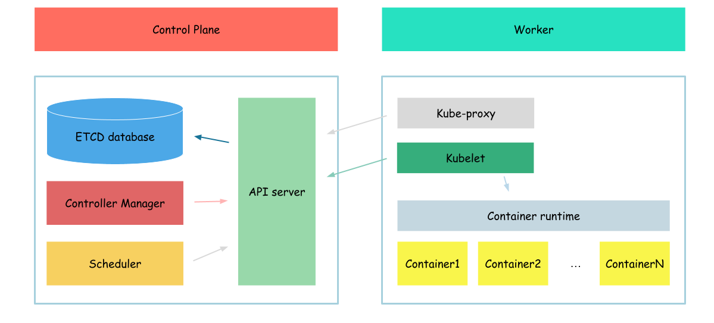

# Controller manager

In this section we will configure controller-manager.



>Controller Manager is a core component responsible for managing various controllers that regulate the desired state of the cluster. It runs as a separate process on the Kubernetes control plane and includes several built-in controllers

To see controller manager in action, we will create deployment before controller manager configured.
```bash
{
cat <<EOF> deployment.yaml
apiVersion: apps/v1
kind: Deployment
metadata:
  name: deployment
spec:
  replicas: 1
  selector:
    matchLabels:
      app: hello-world-deployment
  template:
    metadata:
      labels:
        app: hello-world-deployment
    spec:
        serviceAccountName: hello-world
        containers:
            - name: hello-world-container
              image: busybox
              command: ['sh', '-c', 'while true; do echo "Hello, World from deployment!"; sleep 1; done']
EOF

kubectl apply -f deployment.yaml
}
```

Check created deployment status:
```bash
kubectl get deploy
```

Output:
```
NAME               READY   UP-TO-DATE   AVAILABLE   AGE
nginx-deployment   0/1     0            0           24s
```

As we can se our deployment isn't in ready state.

As we already mentioned, in kubernetes controller manager is responsible to ensure that desired state of the cluster equals to the actual state. In our case it means that deployment controller should create replicaset and replicaset controller should create pod which will be assigned to nodes by scheduler. But as controller manager is not configured - nothing happen with created deployment.

So, lets configure controller manager.

## certificates
We will start with certificates.

As you remeber we configured our API server cto use client certificate to authenticate user.
So, lets create proper certificate for the controller manager
```bash
{
cat > kube-controller-manager-csr.json <<EOF
{
  "CN": "system:kube-controller-manager",
  "key": {
    "algo": "rsa",
    "size": 2048
  },
  "names": [
    {
      "C": "US",
      "L": "Portland",
      "O": "system:kube-controller-manager",
      "OU": "Kubernetes The Hard Way",
      "ST": "Oregon"
    }
  ]
}
EOF

cfssl gencert \
  -ca=ca.pem \
  -ca-key=ca-key.pem \
  -config=ca-config.json \
  -profile=kubernetes \
  kube-controller-manager-csr.json | cfssljson -bare kube-controller-manager
}
```

Created certs:
```
kube-controller-manager.csr
kube-controller-manager-key.pem
kube-controller-manager.pem
```

The most interesting configuration options:
- cn(common name) - value, api server will use as a client name during authorization
- o(organozation) - user group controller manager will use during authorization

We specified "system:kube-controller-manager" in the organization. It says api server that the client who uses which certificate belongs to the system:kube-controller-manager group.

Now, we will distribute ca certificate, this ????
```bash
sudo cp ca-key.pem /var/lib/kubernetes/
```

## configuration

After the certificate files created we can create configuration files for the controller manager.

```bash
{
  kubectl config set-cluster kubernetes-the-hard-way \
    --certificate-authority=ca.pem \
    --embed-certs=true \
    --server=https://127.0.0.1:6443 \
    --kubeconfig=kube-controller-manager.kubeconfig

  kubectl config set-credentials system:kube-controller-manager \
    --client-certificate=kube-controller-manager.pem \
    --client-key=kube-controller-manager-key.pem \
    --embed-certs=true \
    --kubeconfig=kube-controller-manager.kubeconfig

  kubectl config set-context default \
    --cluster=kubernetes-the-hard-way \
    --user=system:kube-controller-manager \
    --kubeconfig=kube-controller-manager.kubeconfig

  kubectl config use-context default --kubeconfig=kube-controller-manager.kubeconfig
}
```

We created kubernetes configuration file, which says controller manager where api server is configured and which certificates to use communicating with it

Now, we can distribute created configuration file.
```bash
sudo mv kube-controller-manager.kubeconfig /var/lib/kubernetes/
```

After all required configuration file created, we need to download controller manager binaries.
```bash
wget -q --show-progress --https-only --timestamping \
  "https://storage.googleapis.com/kubernetes-release/release/v1.21.0/bin/linux/amd64/kube-controller-manager"
```

And install it
```bash
{
  chmod +x kube-controller-manager
  sudo mv kube-controller-manager /usr/local/bin/
}
```

Now, we can create configuration file for controller manager service
```bash
cat <<EOF | sudo tee /etc/systemd/system/kube-controller-manager.service
[Unit]
Description=Kubernetes Controller Manager
Documentation=https://github.com/kubernetes/kubernetes

[Service]
ExecStart=/usr/local/bin/kube-controller-manager \\
  --bind-address=0.0.0.0 \\
  --cluster-cidr=10.200.0.0/16 \\
  --cluster-name=kubernetes \\
  --cluster-signing-cert-file=/var/lib/kubernetes/ca.pem \\
  --cluster-signing-key-file=/var/lib/kubernetes/ca-key.pem \\
  --kubeconfig=/var/lib/kubernetes/kube-controller-manager.kubeconfig \\
  --leader-elect=true \\
  --root-ca-file=/var/lib/kubernetes/ca.pem \\
  --service-account-private-key-file=/var/lib/kubernetes/service-account-key.pem \\
  --service-cluster-ip-range=10.32.0.0/24 \\
  --use-service-account-credentials=true \\
  --v=2
Restart=on-failure
RestartSec=5

[Install]
WantedBy=multi-user.target
EOF
```

After configuration file created, we can start controller manager
```bash
{
  sudo systemctl daemon-reload
  sudo systemctl enable kube-controller-manager
  sudo systemctl start kube-controller-manager
}
```

And finaly we can check controller manadger status
```bash
sudo systemctl status kube-controller-manager
```

Output:
```
● kube-controller-manager.service - Kubernetes Controller Manager
     Loaded: loaded (/etc/systemd/system/kube-controller-manager.service; enabled; vendor preset: enabled)
     Active: active (running) since Thu 2023-04-20 11:48:41 UTC; 30s ago
       Docs: https://github.com/kubernetes/kubernetes
   Main PID: 14805 (kube-controller)
      Tasks: 6 (limit: 2275)
     Memory: 32.0M
     CGroup: /system.slice/kube-controller-manager.service
             └─14805 /usr/local/bin/kube-controller-manager --bind-address=0.0.0.0 --cluster-cidr=10.200.0.0/16 --cluster-name=kubernetes --cluster-signing-cert-file=/var/lib/kubernetes/c>
...
```

As you can see our controller manager is up and running. So we can continue with our deployment.
```bash
kubectl get deploy
```

Output:
```
NAME         READY   UP-TO-DATE   AVAILABLE   AGE
deployment   1/1     1            1           2m8s
```

As you can see our deployment is up anr running, all desired pods are also in running state
```bash
kubectl get pods
```

Output:
```
NAME                          READY   STATUS    RESTARTS   AGE
deployment-74fc7cdd68-89rqw   1/1     Running   0          67s
```

Now, when our controller manager configured, lets clean up our workspace.
```bash
kubectl delete -f deployment.yaml
```

Next: [Kube-proxy](./09-kubeproxy.md)