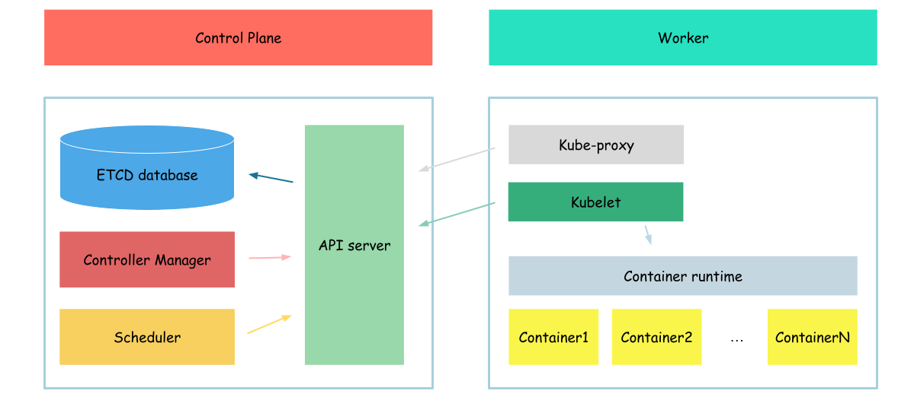

# Scheduler



```bash
{

cat > kube-scheduler-csr.json <<EOF
{
  "CN": "system:kube-scheduler",
  "key": {
    "algo": "rsa",
    "size": 2048
  },
  "names": [
    {
      "C": "US",
      "L": "Portland",
      "O": "system:kube-scheduler",
      "OU": "Kubernetes The Hard Way",
      "ST": "Oregon"
    }
  ]
}
EOF

cfssl gencert \
  -ca=ca.pem \
  -ca-key=ca-key.pem \
  -config=ca-config.json \
  -profile=kubernetes \
  kube-scheduler-csr.json | cfssljson -bare kube-scheduler

}
```

```bash
{
  kubectl config set-cluster kubernetes-the-hard-way \
    --certificate-authority=ca.pem \
    --embed-certs=true \
    --server=https://127.0.0.1:6443 \
    --kubeconfig=kube-scheduler.kubeconfig

  kubectl config set-credentials system:kube-scheduler \
    --client-certificate=kube-scheduler.pem \
    --client-key=kube-scheduler-key.pem \
    --embed-certs=true \
    --kubeconfig=kube-scheduler.kubeconfig

  kubectl config set-context default \
    --cluster=kubernetes-the-hard-way \
    --user=system:kube-scheduler \
    --kubeconfig=kube-scheduler.kubeconfig

  kubectl config use-context default --kubeconfig=kube-scheduler.kubeconfig
}
```

```bash
wget -q --show-progress --https-only --timestamping \
  "https://storage.googleapis.com/kubernetes-release/release/v1.21.0/bin/linux/amd64/kube-scheduler"
```

```bash
{
  chmod +x kube-scheduler
  sudo mv kube-scheduler /usr/local/bin/
}
```


```bash
sudo mv kube-scheduler.kubeconfig /var/lib/kubernetes/
```

```bash
cat <<EOF | sudo tee /etc/kubernetes/config/kube-scheduler.yaml
apiVersion: kubescheduler.config.k8s.io/v1beta1
kind: KubeSchedulerConfiguration
clientConnection:
  kubeconfig: "/var/lib/kubernetes/kube-scheduler.kubeconfig"
leaderElection:
  leaderElect: true
EOF
```

```bash
cat <<EOF | sudo tee /etc/systemd/system/kube-scheduler.service
[Unit]
Description=Kubernetes Scheduler
Documentation=https://github.com/kubernetes/kubernetes

[Service]
ExecStart=/usr/local/bin/kube-scheduler \\
  --config=/etc/kubernetes/config/kube-scheduler.yaml \\
  --v=2
Restart=on-failure
RestartSec=5

[Install]
WantedBy=multi-user.target
EOF
```

```bash
{
  sudo systemctl daemon-reload
  sudo systemctl enable kube-scheduler
  sudo systemctl start kube-scheduler
}
```

```bash
sudo systemctl status kube-scheduler
```

```
● kube-scheduler.service - Kubernetes Scheduler
     Loaded: loaded (/etc/systemd/system/kube-scheduler.service; enabled; vendor preset: enabled)
     Active: active (running) since Thu 2023-04-20 11:57:44 UTC; 16s ago
       Docs: https://github.com/kubernetes/kubernetes
   Main PID: 15134 (kube-scheduler)
      Tasks: 7 (limit: 2275)
     Memory: 13.7M
     CGroup: /system.slice/kube-scheduler.service
             └─15134 /usr/local/bin/kube-scheduler --config=/etc/kubernetes/config/kube-scheduler.yaml --v=2
...
```

```bash
kubectl get pod -o wide
```

```
hello-world                         1/1     Running   0          35m     10.240.1.9    example-server   <none>           <none>
nginx-deployment-5d9cbcf759-x4pk8   1/1     Running   0          9m34s   10.240.1.10   example-server   <none>           <none>
```

```bash
kubectl logs nginx-deployment-5d9cbcf759-x4pk8
```

```
Hello, World from deployment!
Hello, World from deployment!
Hello, World from deployment!
...
```