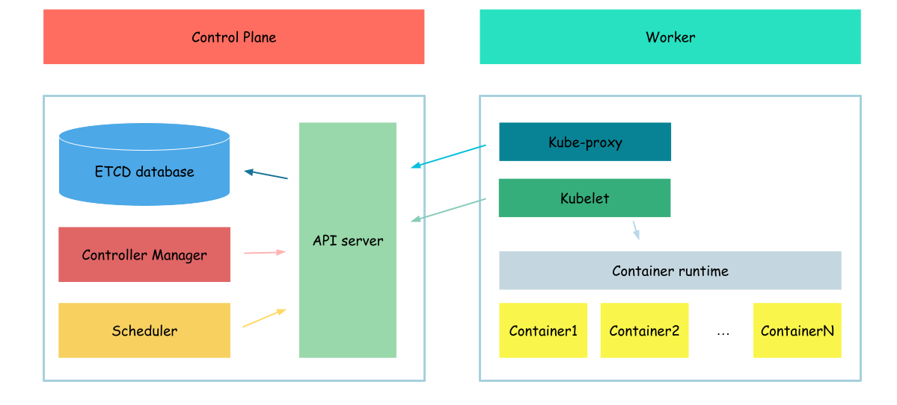

# Kubeproxy



такс, 

```bash
cat <<EOF> nginx-deployment.yml
apiVersion: apps/v1
kind: Deployment
metadata:
  name: nginx-deployment
spec:
  selector:
    matchLabels:
      app: nginx
  replicas: 3
  template:
    metadata:
      labels:
        app: nginx
    spec:
      containers:
      - name: nginx
        image: nginx:1.21.3
        ports:
        - containerPort: 80
EOF

kubectl apply -f nginx-deployment.yml
```

```bash
kubectl get pod -o wide
```

```
NAME                                READY   STATUS    RESTARTS   AGE    IP            NODE             NOMINATED NODE   READINESS GATES
hello-world                         1/1     Running   0          109m   10.240.1.9    example-server   <none>           <none>
nginx-deployment-5d9cbcf759-x4pk8   1/1     Running   0          84m    10.240.1.14   example-server   <none>           <none>
```

нам потрібна айпі адреса поду з деплойменту, в моєму випадку 10.240.1.10
запам'ятаємо її

```bash
cat <<EOF> rbac-create.yml
kind: ClusterRole
apiVersion: rbac.authorization.k8s.io/v1
metadata:
  name: kubernetes-user-clusterrole
rules:
- apiGroups: [""]
  resources: ["nodes/proxy"]
  verbs: ["create"]
---
kind: ClusterRoleBinding
apiVersion: rbac.authorization.k8s.io/v1
metadata:
  name: kubernetes-user-clusterrolebinding
subjects:
- kind: User
  name: kubernetes
  apiGroup: rbac.authorization.k8s.io
roleRef:
  kind: ClusterRole
  name: kubernetes-user-clusterrole
  apiGroup: rbac.authorization.k8s.io
EOF

kubectl apply -f rbac-create.yml
```

```
kubectl exec hello-world -- wget -O - 10.240.1.14
```

```
<!DOCTYPE html>
<html>
<head>
<title>Welcome to nginx!</title>
<style>
html { color-scheme: light dark; }
body { width: 35em; margin: 0 auto;
font-family: Tahoma, Verdana, Arial, sans-serif; }
</style>
</head>
<body>
<h1>Welcome to nginx!</h1>
<p>If you see this page, the nginx web server is successfully installed and
working. Further configuration is required.</p>

<p>For online documentation and support please refer to
<a href="http://nginx.org/">nginx.org</a>.<br/>
Commercial support is available at
<a href="http://nginx.com/">nginx.com</a>.</p>

<p><em>Thank you for using nginx.</em></p>
</body>
</html>
Connecting to 10.240.1.14 (10.240.1.14:80)
writing to stdout
-                    100% |********************************|   615  0:00:00 ETA
written to stdout
```

але це не прикольно, хочу звертатись до нджінк деплойменту і щоб воно там само працювало
знаю що є сервіси - давай через них

```bash
{
cat <<EOF> nginx-service.yml
apiVersion: v1
kind: Service
metadata:
  name: nginx-service
spec:
  selector:
    app: nginx
  ports:
    - protocol: TCP
      port: 80
      targetPort: 80
EOF

kubectl apply -f nginx-service.yml
}
```

```bash
kubectl get service
```

такс тепер беремо айпішнік того сервісу (у моєму випадку 10.32.0.95)
і спробуємо повторити те саме

```bash
kubectl exec hello-world -- wget -O - 10.32.0.95
```

і нічого (тут можна згадати ще про ендпоінти і тп, але то може бути просто на довго)
головна причина чого не працює на даному етапі - у нас не запущений ще 1 важливий компонент
а саме куб проксі

```bash
{
cat > kube-proxy-csr.json <<EOF
{
  "CN": "system:kube-proxy",
  "key": {
    "algo": "rsa",
    "size": 2048
  },
  "names": [
    {
      "C": "US",
      "L": "Portland",
      "O": "system:node-proxier",
      "OU": "Kubernetes The Hard Way",
      "ST": "Oregon"
    }
  ]
}
EOF

cfssl gencert \
  -ca=ca.pem \
  -ca-key=ca-key.pem \
  -config=ca-config.json \
  -profile=kubernetes \
  kube-proxy-csr.json | cfssljson -bare kube-proxy

}
```


```bash
{
  kubectl config set-cluster kubernetes-the-hard-way \
    --certificate-authority=ca.pem \
    --embed-certs=true \
    --server=https://127.0.0.1:6443 \
    --kubeconfig=kube-proxy.kubeconfig

  kubectl config set-credentials system:kube-proxy \
    --client-certificate=kube-proxy.pem \
    --client-key=kube-proxy-key.pem \
    --embed-certs=true \
    --kubeconfig=kube-proxy.kubeconfig

  kubectl config set-context default \
    --cluster=kubernetes-the-hard-way \
    --user=system:kube-proxy \
    --kubeconfig=kube-proxy.kubeconfig

  kubectl config use-context default --kubeconfig=kube-proxy.kubeconfig
}
```

```bash
wget -q --show-progress --https-only --timestamping \
  https://storage.googleapis.com/kubernetes-release/release/v1.21.0/bin/linux/amd64/kube-proxy
```

```bash
sudo mkdir -p \
  /var/lib/kube-proxy
```

```bash
{
    chmod +x kube-proxy 
    sudo mv kube-proxy /usr/local/bin/
}
```

```bash
sudo mv kube-proxy.kubeconfig /var/lib/kube-proxy/kubeconfig
```

```bash
cat <<EOF | sudo tee /var/lib/kube-proxy/kube-proxy-config.yaml
kind: KubeProxyConfiguration
apiVersion: kubeproxy.config.k8s.io/v1alpha1
clientConnection:
  kubeconfig: "/var/lib/kube-proxy/kubeconfig"
mode: "iptables"
clusterCIDR: "10.200.0.0/16"
EOF
```

```bash
cat <<EOF | sudo tee /etc/systemd/system/kube-proxy.service
[Unit]
Description=Kubernetes Kube Proxy
Documentation=https://github.com/kubernetes/kubernetes

[Service]
ExecStart=/usr/local/bin/kube-proxy \\
  --config=/var/lib/kube-proxy/kube-proxy-config.yaml
Restart=on-failure
RestartSec=5

[Install]
WantedBy=multi-user.target
EOF
```

```bash
{
  sudo systemctl daemon-reload
  sudo systemctl enable kube-proxy
  sudo systemctl start kube-proxy
}
```

```bash
sudo systemctl status kube-proxy
```

```
● kube-proxy.service - Kubernetes Kube Proxy
     Loaded: loaded (/etc/systemd/system/kube-proxy.service; enabled; vendor preset: enabled)
     Active: active (running) since Thu 2023-04-20 13:37:27 UTC; 23s ago
       Docs: https://github.com/kubernetes/kubernetes
   Main PID: 19873 (kube-proxy)
      Tasks: 5 (limit: 2275)
     Memory: 10.0M
     CGroup: /system.slice/kube-proxy.service
             └─19873 /usr/local/bin/kube-proxy --config=/var/lib/kube-proxy/kube-proxy-config.yaml
...
```

ну що, куб проксі поставили - потрібно провіряти


```bash
kubectl exec hello-world -- wget -O - 10.32.0.95
```

```
<!DOCTYPE html>
<html>
<head>
<title>Welcome to nginx!</title>
<style>
html { color-scheme: light dark; }
body { width: 35em; margin: 0 auto;
font-family: Tahoma, Verdana, Arial, sans-serif; }
</style>
</head>
<body>
<h1>Welcome to nginx!</h1>
<p>If you see this page, the nginx web server is successfully installed and
working. Further configuration is required.</p>

<p>For online documentation and support please refer to
<a href="http://nginx.org/">nginx.org</a>.<br/>
Commercial support is available at
<a href="http://nginx.com/">nginx.com</a>.</p>

<p><em>Thank you for using nginx.</em></p>
</body>
</html>
Connecting to 10.32.0.95 (10.32.0.95:80)
writing to stdout
-                    100% |********************************|   615  0:00:00 ETA
written to stdout
```
ух ти у нас все вийшло

Next: [DNS in Kubernetes](./docs/10-dns.md)